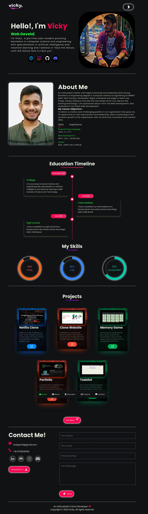

<h1>My Personal Portfolio </h1>

A portfolio site is an extension of a freelancer’s (or company’s) résumé. It provides a convenient way for potential clients to view your work while also allowing you to expand on your skills and services. This, however, isn’t the ultimate purpose of a portfolio website.

<h3>Preview:-</h3>

Link to this page: https://vicky2742.github.io/Portfolio-/

